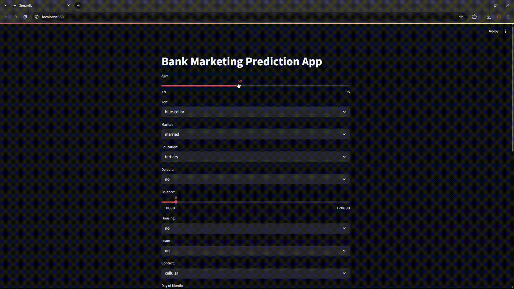

# 🏦 Bank Marketing Prediction Application

An interactive web application built with Python and Streamlit to predict customer subscription to a term deposit based on a comprehensive bank marketing dataset. This project encompasses data analysis, machine learning model training, and a user-friendly interface for real-time predictions.

---

### Application Demo

 


## Unlocking Customer Intent with Machine Learning

Imagine: A bank campaign calls. Do they subscribe to a term deposit, or not? This project isn't just about answering "yes" or "no"; it's about diving deep into the "why" behind customer decisions and empowering financial institutions with predictive intelligence.

This isn't your average data dump. We've embarked on a data science odyssey, culminating in an interactive Streamlit application that puts the power of prediction directly into your hands. From raw campaign logs to a sleek, user-friendly interface, we've transformed numbers into foresight.

---

### 🌟 The Core of the Quest: What We Built

At its heart, this project is a fusion of meticulous data analysis and robust machine learning. We started with the intricate "Bank Marketing" dataset from the UCI Machine Learning Repository, a treasure trove of direct marketing campaign data from a Portuguese banking institution. Each row tells a story: client demographics, last contact details, and the outcomes of previous interactions. Our mission? To predict that elusive 'y' – whether a client will subscribe to a term deposit.

The journey unfolds in two main acts:

1.  **The Alchemist's Lab (Jupyter Notebook):** Our `Portuguese_Bank.ipynb` is where the magic happens. It's a deep dive into the raw data, featuring:
    * **Data Unveiling:** A first look at the dataset, its structure, and initial insights.
    * **Unmasking Categories:** Visual explorations of non-numerical features, revealing their hidden patterns and how they sway subscription rates.
    * **Numeric Narratives:** Statistical summaries and correlation heatmaps that paint a picture of how numerical attributes dance together.
    * **Feature Forging:** Transforming raw, messy data into pristine numerical inputs, ready for the algorithms.
    * **Model Menagerie:** We put a diverse set of machine learning gladiators into the arena – Decision Trees, Random Forests, K-Nearest Neighbors, SVMs, Logistic Regression, MLPs, and Gaussian Naive Bayes – to see who emerges victorious in the accuracy stakes.
    * **Performance Post-Mortem:** A detailed breakdown of each model's strengths and weaknesses, complete with confusion matrices and classification reports, because accuracy isn't the whole story.

2.  **The Oracle's Gaze (Streamlit Application):** Our `main.py` file is the user-facing marvel. It's where the distilled wisdom of our models comes alive:
    * **Intuitive Interface:** A clean, interactive dashboard where anyone can input client details via sliders and dropdowns.
    * **Instant Predictions:** Watch as the chosen model processes your inputs and delivers a real-time prediction – a confident "Yes!" or a thoughtful "No" – along with a probability score.
    * **Model Selection:** Choose your preferred predictive oracle from our curated list of champions.

---

### 🛠️ The Tech Stack: Our Tools of the Trade

This project was forged using a powerful arsenal of Python libraries:

* **Python:** The bedrock of our entire operation.
* **Streamlit:** For conjuring the interactive web application.
* **Pandas:** The master alchemist, transforming raw data into refined insights.
* **NumPy:** The numerical powerhouse, underpinning all mathematical computations.
* **Scikit-learn:** Our go-to for a diverse array of machine learning models and preprocessing sorcery.
* **Matplotlib & Seaborn:** The artistic duo, crafting compelling visual narratives from data.
* **Jupyter Notebook:** Our digital scroll, documenting every step of our analytical journey.

---

### 📥 The Scrolls of Data: Our Knowledge Base

Our insights are rooted in the well-known **"Bank Marketing" dataset**. This publicly available dataset provides a realistic scenario of a bank's direct marketing efforts, allowing for robust analysis and model training.

* **Source:** [UCI Machine Learning Repository](https://archive.ics.uci.edu/ml/datasets/Bank+Marketing)

---

### 🚀 Getting Started

To get a local copy up and running, follow these simple steps.

#### Prerequisites

Ensure you have Python (3.8+) and `pip` (Python's package installer) readily available on your system.

#### Installation & Setup

1.  **Claim Your Repository:**
    ```sh
    git clone https://github.com/hmdrzam/interactive-bank-marketing-prediction.git
    ```

2.  **Enter the Sanctuary:**
    ```sh
    cd bank-marketing-prediction
    ```

3.  **Forge Your Environment (Highly Recommended):**
    * **Windows:**
        ```sh
        python -m venv venv
        .\venv\Scripts\activate
        ```
    * **macOS/Linux:**
        ```sh
        python3 -m venv venv
        source venv/bin/activate
        ```

4.  **Install the required packages from `req.txt`:**
    ```sh
    pip install -r req.txt
    ```

5.  **Awaken the Knowledge (Data & Models):**
    The `Portuguese_Bank.ipynb` notebook handles the acquisition of the `bank.zip` dataset. **Crucially, run all cells within `Portuguese_Bank.ipynb` first.** This process will:
    * Download the dataset.
    * Perform all the data preprocessing and feature engineering steps.
    * Train the machine learning models.
    * **Save the trained models, `LabelEncoder`, and `StandardScaler` as `.pickle` files.** These files are essential for the Streamlit application to make predictions. Ensure they are saved in a `models` subdirectory within your project.

6.  **Unleash the Oracle:**
    Once your models are trained and saved, launch the Streamlit application:
    ```sh
    streamlit run main.py
    ```

7.  **Witness the Prediction:**
    Open your web browser and navigate to the local URL provided by Streamlit (typically `http://localhost:8501`). Prepare to unveil the future of bank marketing!
